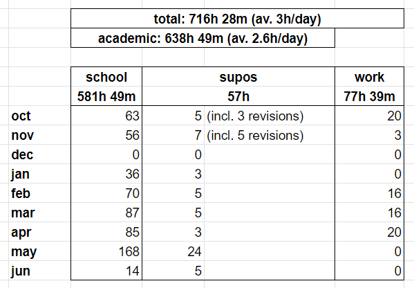
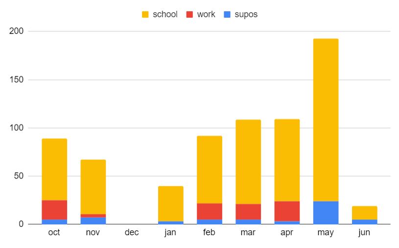

## Year 2

[Back to home](/)

### Course Structure
- Structure is quite similar to [Year 1](/year_1.md), there were more courses this time (17 examinable courses in total) - but without NST Maths the number of course hours is _roughly_ the same (although most people tend to find the Year 2 topics more challenging than NST Maths, since the latter overlaps slightly with/is a direct extension from A levels)
- Not all courses on the [course website](https://www.cl.cam.ac.uk/teaching/2425/part1b.html) are examinable

### Average Workload
- This year I spent 77 hours on personal projects / career stuff, 581 hours on schoolwork (exam prep + watching/going to lectures + doing supervision work), 57 hours on supervision sessions (including 8 revision sessions) over 253 days  

### Assessment
- Similar to first year, except there is more freedom in terms of question choice (so you could revise really hard for some topics and drop a few)

- 
